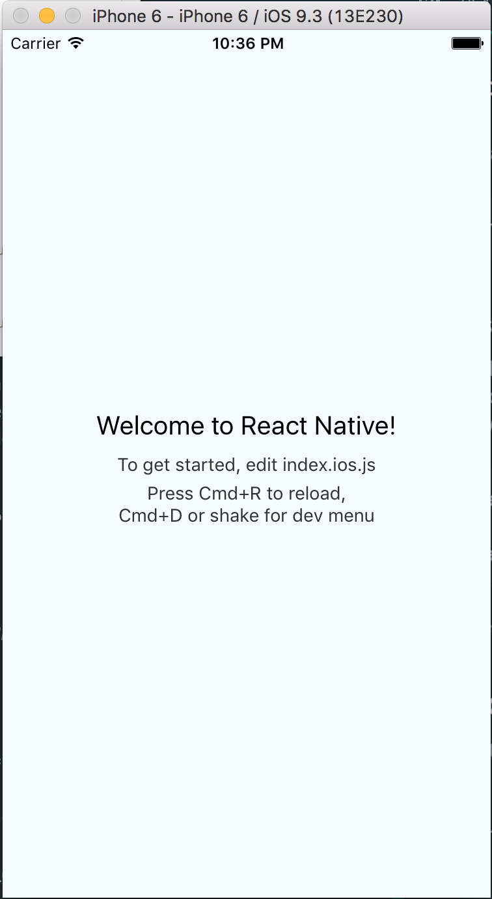
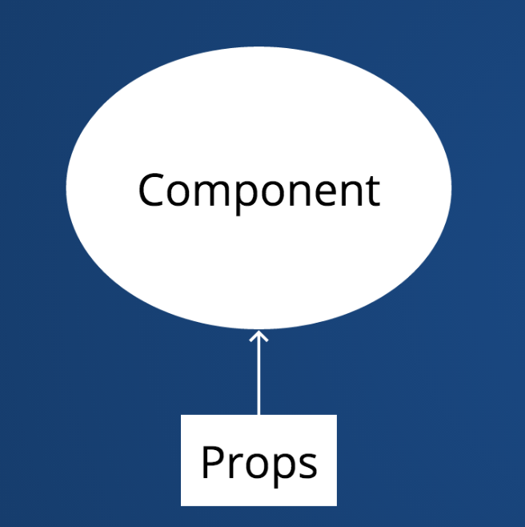
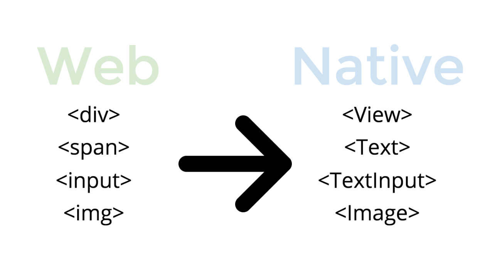
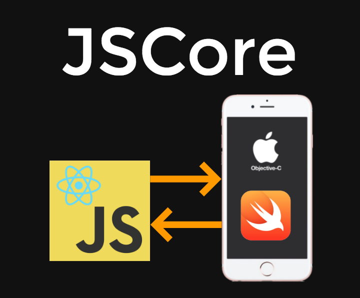
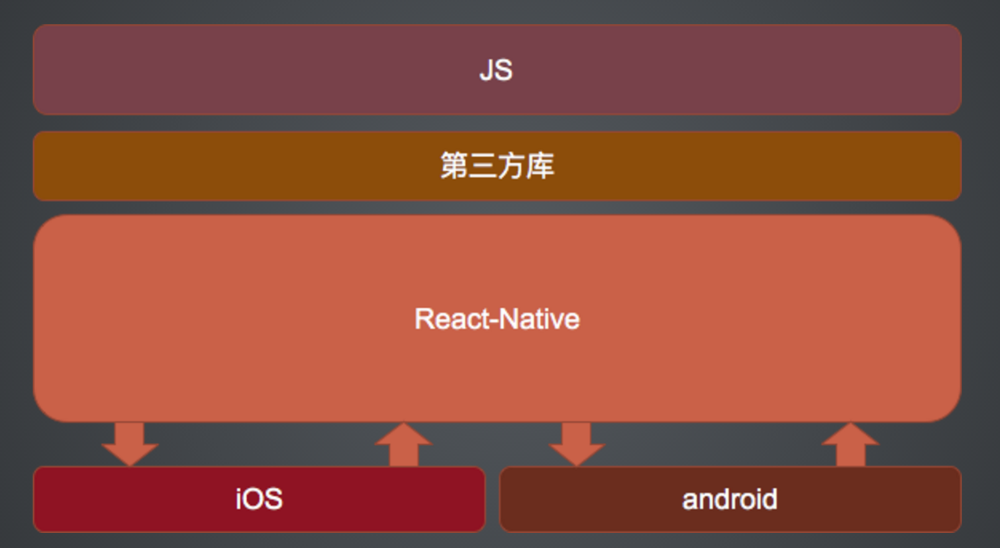

# React Native Workshop For LOOT


## 1. Set up environment
We will need Xcode, node.js, the React Native command line tools, and Watchman.

We recommend installing node and watchman via Homebrew.

#### Xcode

Xcode 7.0 or higher is required. You can install Xcode via the App Store or Apple developer downloads. This will install the Xcode IDE and Xcode Command Line Tools.


#### NodeJS

```
brew install node
```
*NodeJS 4.0 or greater is required for React Native. The default Homebrew package for Node is currently 6.0, so that is not an issue.*

#### Watchman

Watchman is a tool by Facebook for watching changes in the filesystem. It is recommended you install it for better performance.

```
brew install watchman
```

#### React Native Command Line Tools

Node comes with npm, which lets you install the React Native command line interface.

```
npm install -g react-native-cli
```

### Testing Installation

Use the React Native command line tools to generate a new React Native project called "AwesomeProject", then run react-native run-ios inside the newly created folder.

```
react-native init AwesomeProject
cd AwesomeProject
react-native run-ios
```
*You should see your new app running in the iOS Simulator shortly.*



### Modifying your app

Now that you have successfully run the app, let's modify it.

Open index.ios.js in your text editor of choice and edit some lines.
Hit Command⌘ + R in your iOS Simulator to reload the app and see your change!


### Learning ES6 and Flexbox Layout

- [ECMAScript 6 — New Features: Overview & Comparison](http://es6-features.org)
- [ECMAScript 6 入门](http://es6.ruanyifeng.com/)
- [A Complete Guide to Flexbox](https://css-tricks.com/snippets/css/a-guide-to-flexbox/)

## 2. React Native Intro

A framework for building native apps using react。

#### What is React Native

- Create Native Apps in Javascript
- Using React.js concept
- No Webview

###### React Basics
  - Component
```
var SampleApp = React.createClass({
    // you can get the props in component
    // you can pass props to another component
    // immutable
});  
```


- State
  - mutable
  - private to the component
  - change => re-rendering

  ```
  var SampleApp = React.createClass({
    getInitialState() {
      return {count: 0};
    },

    incrementCount() {
      this.setState({
          count: this.state.count + 1
      });
    },

    ...
});```

- Rendering
  ```
    var React = require('react');

    var SampleApp = React.createClass({
      getInitialState() {
        return {count: 0};
      },

      incrementCount() {
        this.setState({
            count: this.state.count + 1
          });
      },

      render() {
        return (
          <div>
            <h2>My first React app</h2>
            <span onClick={this.incrementCount}>
              {this.state.count} clicks
            </span>
          </div>
        )
      }
    });

  React.render(<SampleApp />, document.querySelector('body'));
  ```
- Virtual DOM


##### React Native vs. React
- No DOM
- Flex layout

```
var React = require('react-native');
var {View, Text} = React;

var SampleApp = React.createClass({
    getInitialState() {
      return {count: 0};
    },

    incrementCount() {
      this.setState({
          count: this.state.count + 1
      });
    },

    render() {
      return (
        <View style={styles.container}>
          <Text style={styles.welcome}>My first React app</Text>
          <Text onPress={this.incrementCount}>
            {this.state.count} clicks
          </Text>
        </View>
      )
    }
});

var styles = StyleSheet.create({
  container: {
    flex: 1,
    justifyContent: 'center',
    alignItems: 'center',
    backgroundColor: '#F5FCFF',
  },
  ...
});

AppRegistry.registerComponent('SampleApp', () => SampleApp);
```


#### Why React Native?

- The focus of React Native is on developer efficiency across all the platforms you care about.
*Learn once, write anywhere.*

- Flexbox layout

- Web development workflow

- Share common code

- Free, open source

- Native

- Live-reload

- OTA updates

- Community

- Developer experience


#### React Native环境与原理
##### React Native运行环境:

- 运行需要JS环境
- iOS平台:内置JavaScriptCore

- Android平台:采用Webkit.org官方开源的库。同时还集成了第三方开源库: fresco,okhttp

React Native 会把应用的 JS 代码（包括依赖的 framework ）编译成一个js文件（一般命名为index.android.bundle),  React Native进行解释运行该脚本文件:
- 如果是 js 扩展的 API, 则直接通过 bridge调用 native 方法;
- 如果是 UI 界面,则映射到 virtual DOM 这个虚拟的 JS 数据结构中，通过 bridge 传递到 native ，然后根据数据属性设置各个对应的真实native的View。
- bridge 是一种 JS 和原生代码通信的机制,用 bridge 函数传入对方 module 和 method 即可得到异步回调的结果。


